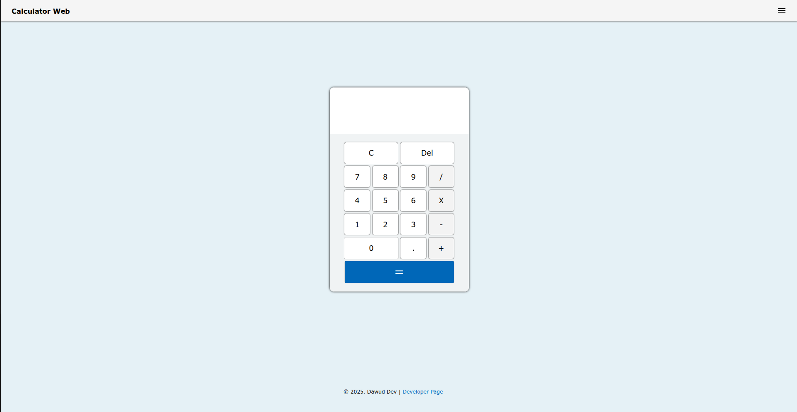
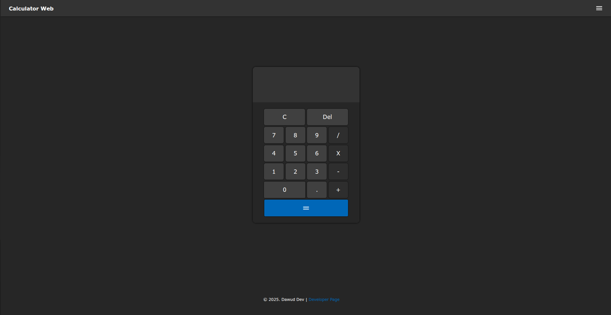

## Calculator Web

A simple responsive, and fully functional web calculator built with HTML, CSS, and JavaScript. It provides the standard arithmetic operations (addition, subtraction, multiplication, division) and includes a small set of UI and accessibility features.

## Highlights / Features

- Theme selector: a small control in the top-right lets users pick Window Default, Light, or Dark theme. The selected preference is persisted in localStorage.
- Digits Limit: the calculator supports up to *16* digits for high value inputs and results.
- Keyboard handling: the app prevents unwanted default keys and maps number, operators, clear (C), delete (Backspace), and Enter to calculator actions.
- Basic arithmetic operations: `+`, `-`, `×`, `÷`
- Chain calculations (e.g., 10 + 5 × 2 – 3)
- Auto-resizing display font for long numbers
- Smart decimal handling
- Error handling (division by zero, syntax errors)
- Three theme modes:
  - Light
  - Dark
  - Window Default (follows system preference)
- Persistent theme selection using localStorage
- Fully responsive design (desktop to mobile)
- Slide-in menu with About section

## Keyboard Shortcuts and Controls

- Numbers: `0-9`
- Decimal point: `.`
- Operations: `+`, `-`, `*`, `/`
- Clear: `C` or `c`
- Delete / backspace: `Backspace`
- Solve / equals: `Enter`

## Tech Stack

- HTML5
- CSS3 (with CSS variables and media queries)
- Vanilla JavaScript

## Steps to run

1. Clone the repository or download the files.
2. Extract the files.
2. Open `index.html` in a modern browser (Chrome, Edge, Firefox, Safari). No build step or server is required.

## Contributing

Contributions are very welcome! Whether it's bug fixes, new features, UI improvements, or better documentation — all help is appreciated.
Please read the  for details on how to contribute.

## License

This project is licensed under the MIT License. See [LICENSE](LICENSE) for details.
