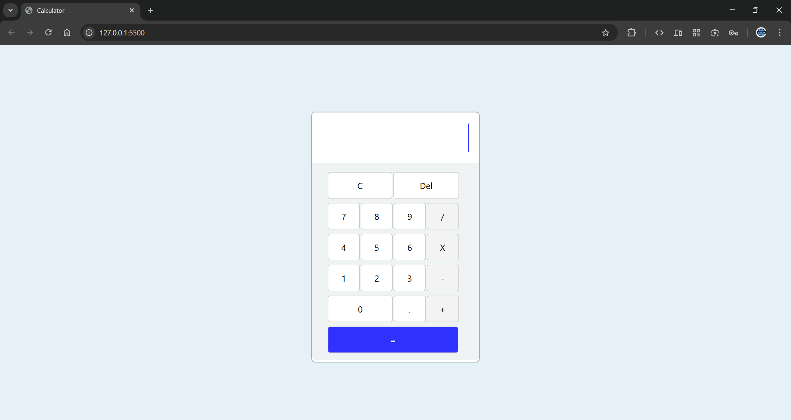

# Calculator Web

A simple web-based calculator built with HTML, CSS, and JavaScript.  
This calculator supports basic arithmetic operations: addition, subtraction, multiplication, and division.

## Features

- Responsive and clean user interface
- Keyboard support for quick calculations
- Clear and delete functions
- Handles decimal numbers




## Keyboard Shortcuts

- Numbers: `0-9`
- Decimal: `.`
- Operations: `+`, `-`, `*`, `/`
- Clear: `C` or `c`
- Delete: `Backspace`
- Solve: `Enter`

## Project Structure

```
calculator-web/
├── index.html
├── style.css
├── script.js
└── README.md
```

## License

This project is licensed under the MIT License. See [LICENSE](LICENSE) for details.

---

Feel free to use this or contribute !!!.