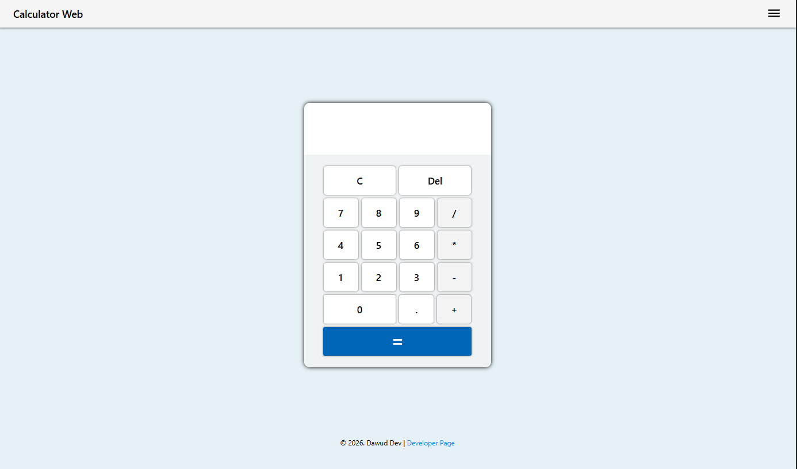

# Calculator Web

A modern, responsive, and fully functional web calculator built with HTML, CSS, and JavaScript. It provides standard arithmetic operations paired with a robust modular state machine, high percentage level of result accuracy (98%), and precise error-handling boundaries.



## Highlights & Core Features

- **Theme Selector:** A clean control in the menu lets users choose between Window Default (system preference), Light, or Dark theme. Your preference is automatically persisted in `localStorage`.
- **Digits Limit:** Supports up to *16* digits for high-value operations with an auto-resizing display font to prevent text clipping.
- **Keyboard Handling:** Maps physical keys seamlessly to calculator actions while safely intercepting unwanted browser default shortcuts.
- **Chain Calculations:** Fully supports consecutive multi-step calculations (e.g., `10 + 5 × 2 – 3`) without breaking execution flow.
- **Slide-in Navigation:** Includes an accessible slide-out panel featuring an About section.

## New Features & Architecture Updates

- **Modular ES Modules:** Codebase split into single-responsibility modules for cleaner maintenance and readability.
- **Centralized State Engine:** Improved calculation accuracy and error handling.

## Keyboard Shortcuts and Controls

| Key | Assigned Action |
| :--- | :--- |
| `0-9` | Input Digits |
| `.` | Decimal Point |
| `+`, `-`, `*`, `/` | Basic Operations (`+`, `-`, `×`, `÷`) |
| `C` or `c` | Reset (`All Clear`) |
| `Backspace` | Delete last entered digit |
| `Enter` | Solve / Evaluate Equation |

## Tech Stack

- **Markup:** HTML5
- **Styling:** CSS3 (featuring responsive media queries and custom property CSS variables)
- **Logic:** JavaScript (ES Modules architecture)

## Steps to Run

[](https://dawud-shuaibu.github.io/calculator/)

1. Clone the repository:
   ```bash
   git clone [https://github.com/Dawud-Shuaibu/calculator.git](https://github.com/Dawud-Shuaibu/calculator.git)
  ```

2. Navigate into the directory or extract the project files.
Open index.html directly in your preferred modern browser and it'll be ready to work.

### Contributing
Contributions welcome! Whether you are looking to fix any issues or add features.

Please read CONTRIBUTION.md for more.

### License
This project is open-source software licensed under the MIT License.